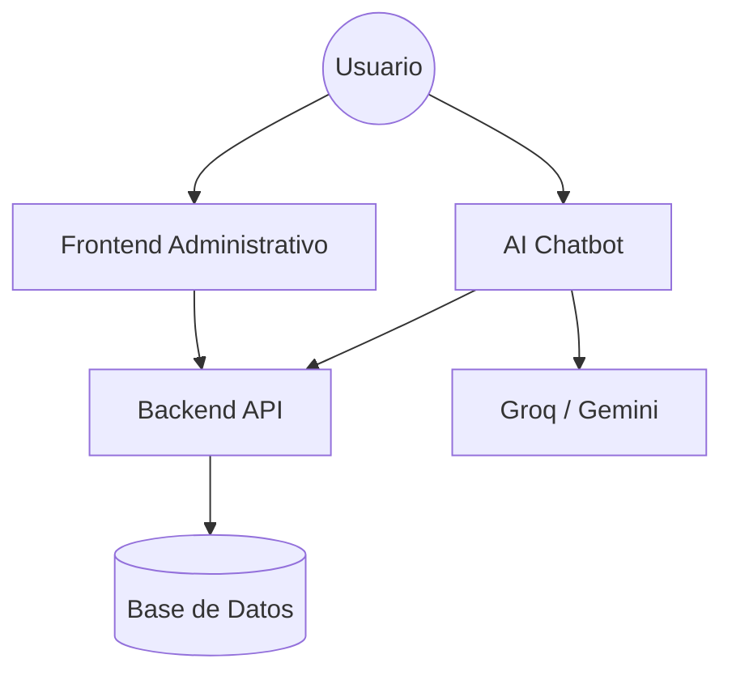

# Estructura del Proyecto

GIMA se organiza bajo una arquitectura de micro-servicios simplificada o multi-repositorio, donde cada pieza tiene una responsabilidad única pero colaborativa.

## 🗺️ Mapa del Ecosistema

## 📁 Repositorios y Carpetas Clave

### 1. `gima-backend` (Laravel 12)

- `app/Models/`: Definición de entidades de negocio (Activos, Órdenes, etc).
- `app/Http/Controllers/Api/`: Lógica de los endpoints REST.
- `database/migrations/`: Estructura evolutiva de la base de datos.
- `routes/api.php`: Definición de rutas públicas y protegidas.

### 2. `gima-ai-chatbot` (Next.js 16)

- `src/app/api/chat/`: Endpoint de streaming para la IA.
- `src/lib/ai/`: Servicios wraper para Groq y Gemini.
- `src/components/chat/`: Interfaz reactiva del chatbot.
- `src/app/actions/`: Server Actions para manejo de archivos y voz.

### 3. `gima-project` (Next.js 16)

- `src/features/`: Módulos de gestión (Inventario, Activos, Órdenes).
- `src/components/ui/`: Biblioteca de componentes basada en shadcn/ui.
- `src/styles/`: Configuración global de Tailwind 4.
